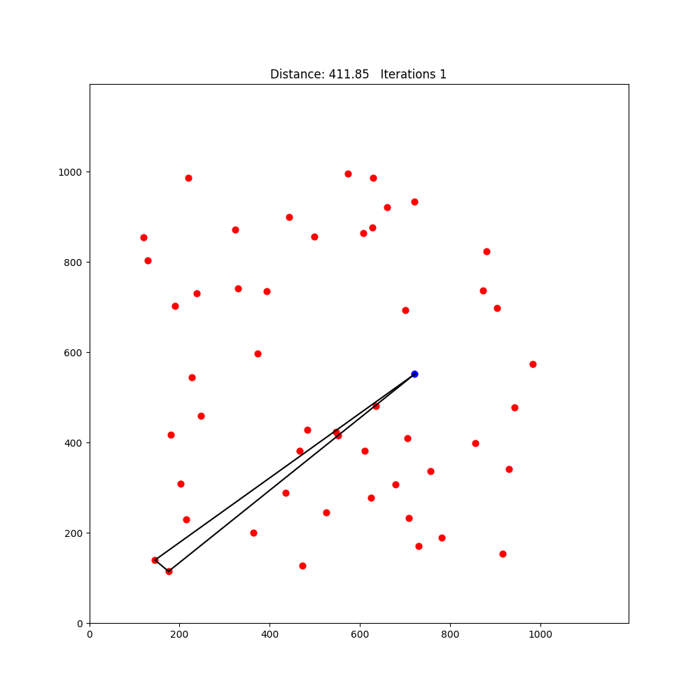
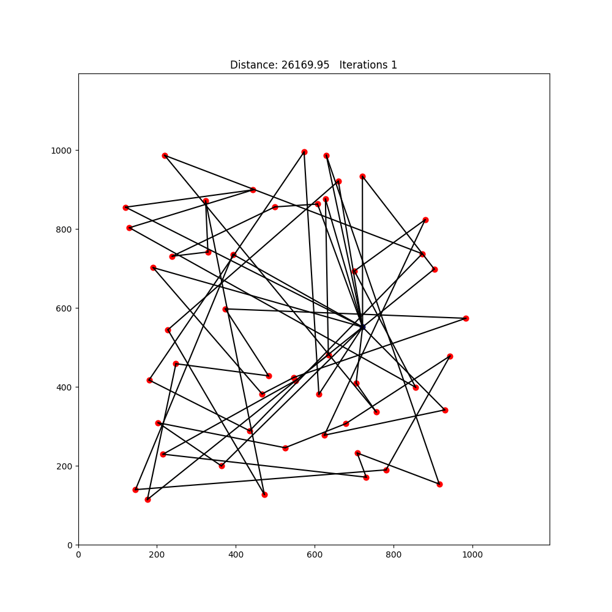
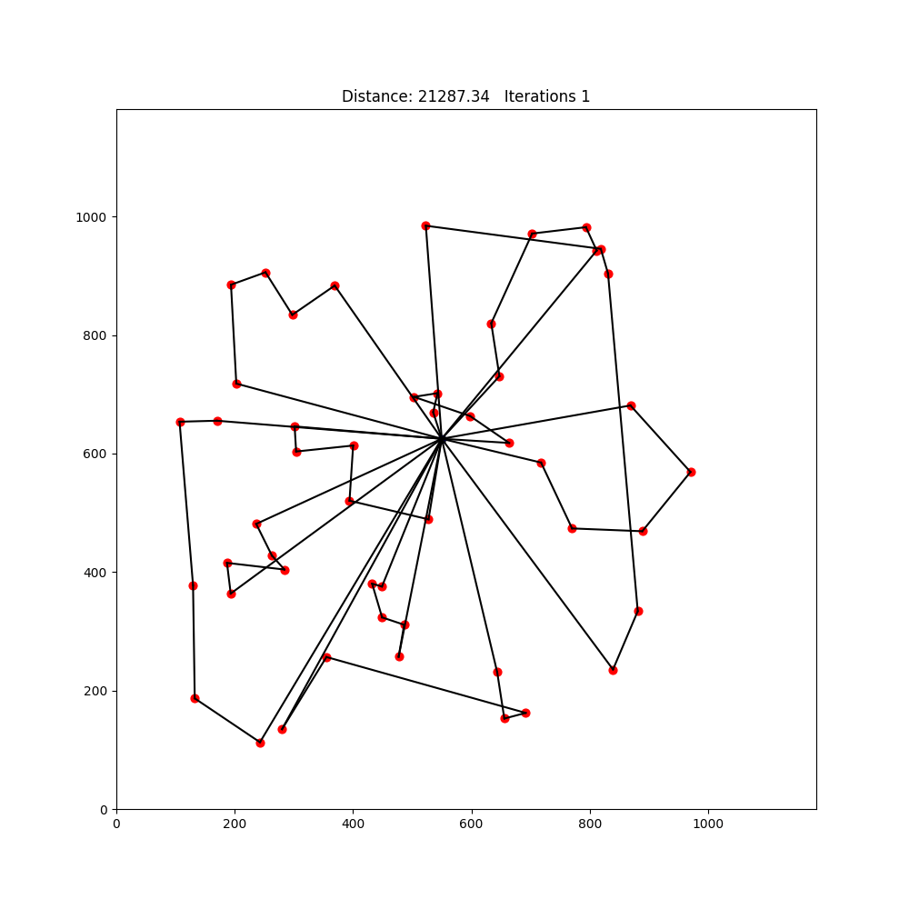
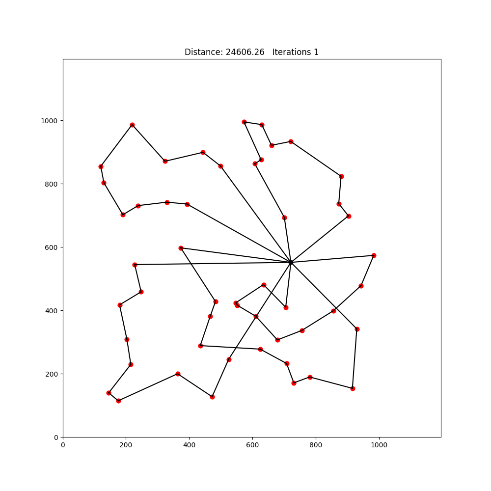
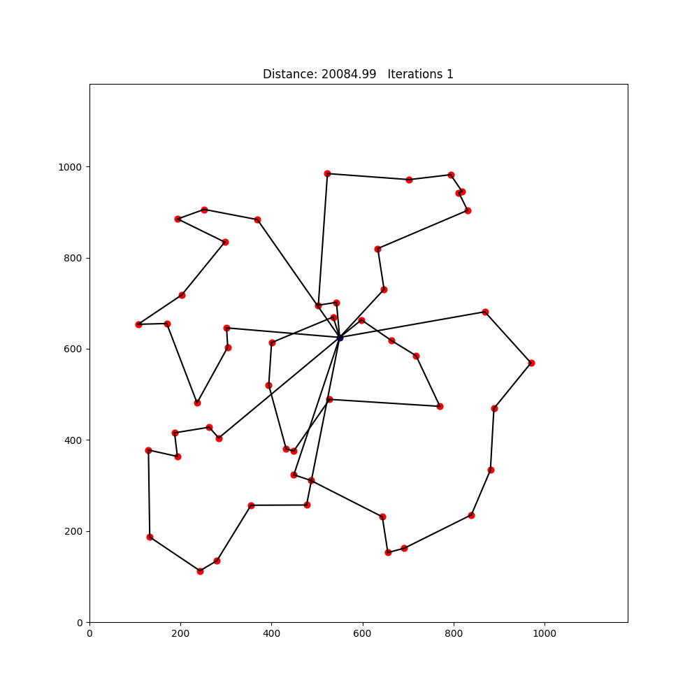

Vehicle Routing Problem Solver

## Table of Contents
- [Project Overview](#project-overview)
- [Clarke-Wright Algorithm Steps](#clarke-wright-algorithm)
- [Genetic Algorithm Steps](#genetic-algorithm)
- [Requirements](#requirements)
- [How to Run](#how-to-run)
- [Examples](#examples)

## Project Overview
This project uses Python bindings to allow users to access C++ solvers for the vehicle routing problem. The vehicle routing problem is an NP-hard problem that is well known in the world of optimization and operations research. There are many variants but the version this project tackles is this: There is one depot location and multiple delivery locations. The goal is to find the shortest set of routes that visit each delivery location exaclty once and return to the depot. As if the routes are delivery trucks with limited capacity, each route has a maximum number of locations it can deliver to. 

As the number of delivery locations increases, solving for an exact solution quickly becomes infeasible. For that reason, this project implements a heuristic solver (the Clarke-Wright algorithm) and a metaheuristic solver (a genetic algorithm). The Clarke-Wright algorithm provides a fast and very efficient set of routes, based on calculating savings that would come from joining locations into the same route. The genetic algorithm creates a population of possible solutions and simulates evolution by combining routes from different parent solutions in an attempt to create more fit next generation. The genetic algorithm also allows for random mutations in an attempt to discover new optimal solutions.

In practice, the genetic algorithm can result in a significant improvement when starting from a population of random solutions or the nearest neighbour solution (travelling to closest location until the maximum is reached for that route or all locations have been visited). The genetic algorithm also consistently improves on the Clarke-Wright solution, but rarely by more than 2%.

## Clarke-Wright Algorithm Steps
1. Pretend every location is in its own route.
2. Create savings list and order by descending savings amounts. One entry consists of two locations and the savings that would come from joining them.
3. Iterate through sorted savings list and do one of three things as long it does not create a route with more locations than maxPackages:
    - If both points i and j have not been included in a route create a new route by connecting them
    - If only one of i or j has been included in a route and it is not in the interior of the route, the link i-j will be added to the route
    - If both i and j have been included in a route and they are both not interior points, connect their routes
4. Any points not included in a route create their own route that consists of only that point.
5. Add the depot to the beginning and ending of each route.

## Genetic Alorithm Steps
1. Start with some initial population of sets of routes, dictated by startingType.
2. Evaluate the fitness of each set of routes (total distance)
3. Select the parents or the next generation via tournament style: For each parent randomly choose three possible candidates and select the one with the better fitness.
4-6 are performed for each two parents right after they are selected, in the createChild function.
    4. Route Crossover: Copy half of the fittest parent's routes to intialize the child routes. Fill in the rest of the locations based on the second parent.
       Check if combining any routes saves on distance.
    5. Mutation: With some probability, randomly move one location to a different route.
    6. Memetic Algorithm: Perform a 2-opt search in each route.
7. Repeat Steps 2-6 until the maximum number of inted gnerations is hit.

## Requirements

- Python 3.x  
- OpenMP (for parellel computing)
- Catch2 (for testing in c++)

## How to Run

### Python API

1. **Clone this repository**
    ```bash
    git clone https://github.com/coopergau/vehicle-routing-problem
    cd vehicle-routing-problem
    ```

1. **Install necessary dependencies**
    ```bash
    sudo apt-get update
    sudo apt-get install -y catch2
    ```

2. **Install the API**
    ```bash
    pip install .
    ```

3. **Use the example folder (or make your own)**
    ```bash
    cd example
    ```

4. **Run the example**
    ```bash
    python3 main.py
    ```

### Raw C++ Code

1. **Clone this repository**
    ```bash
    git clone https://github.com/coopergau/vehicle-routing-problem
    cd vehicle-routing-problem
    ```

2. **Install dependencies**
    ```bash
    sudo apt-get update
    sudo apt-get install -y catch2 build-essential cmake libomp-dev
    ```

3. **Build with CMake**
    ```bash
    mkdir build
    cd build
    cmake -DBUILD_PYTHON_BINDINGS=OFF ..
    make
    ```

4. **Run the executable**
    ```bash
    ./vrp
    ```

5. **Run the tests**
    ```bash
    ./vrp_tests
    ```

## Examples

### Clarke-Wright Algorithm Progress


### Genetic Algorithm Evolution 
#### Starting from random
Significant improvement from initial random routes but much worse than the Clarke-Wright solution. 


#### Starting from nearest neighbours
Decent improvement from initial nearest neighbour routes but still worse than the Clarke-Wright solution. 


#### Starting from Clarke-Wright
Only a minor improvement but slightly better than the Clarke-Wright solution.


#### Starting from mixed
Sometimes the increase in diversity can result in a better solution, but in this case the result is the same as starting from the Clarke-Wright solution.
