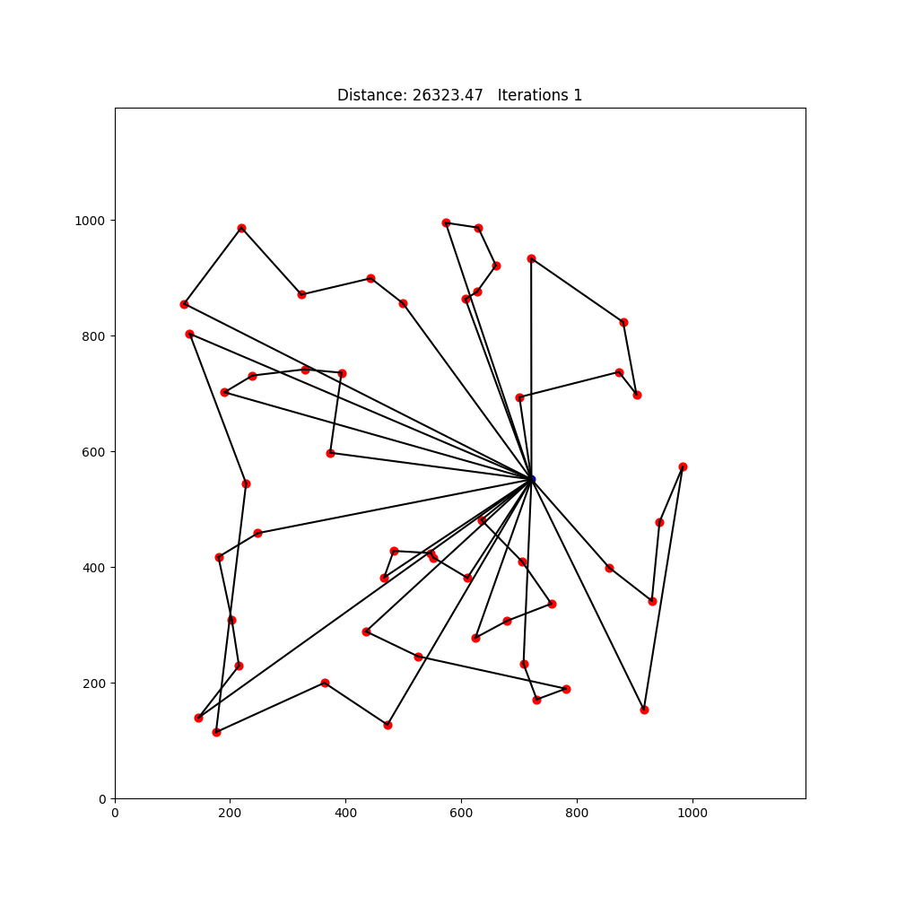

Vehicle Routing Problem Solver

## Table of Contents
- [Project Overview](#project-overview)
- [Requirements](#requirements)
- [How to Run](#how-to-run)
- [Examples](#examples)

## Project Overview
This project uses Python bindings to allow users to access C++ solvers for the vehicle routing problem. The vehicle routing problem is an NP-hard problem that is well known in the world of optimization and operations research. There are many variants but the version this project tackles is this: There is one depot location and multiple delivery locations. The goal is to find the shortest set of routes that visit each delivery location exaclty once and return to the depot. As if the routes are delivery trucks with limited capacity, each route has a maximum number of locations it can deliver to. 

As the number of delivery locations increases, solving for an exact solution quickly becomes infeasible. For that reason, this project implements a heuristic solver (the Clarke-Wright algorithm) and a metaheuristic solver (a genetic algorithm). The Clarke-Wright algorithm provides a fast yet very efficient set of routes, based on calculating savings that would come from joining locations into the same route. The genetic algorithm creates a population of possible solutions and simulates evolution by combining routes from different parent solutions in an attempt to create better next generation. The genetic algorithm also allows for random mutations in an attempt to discover new optimal solutions.

In practice, the genetic algorithm can result in a significant improvement when starting from a population of random solutions or the nearest neighbour solution. it consistently improves on the Clarke-Wright solution, but rarely by more than 2%.

## Requirements

- Python 3.x  
- OpenMP (for parellel computing)
- Catch2 (for testing in c++)

## How to Run

### Python API

1. **Clone this repository**
    ```bash
    git clone https://github.com/coopergau/vehicle-routing-problem
    cd vehicle-routing-problem
    ```

1. **Install necessary dependencies**
    ```bash
    sudo apt-get update
    sudo apt-get install -y catch2
    ```

2. **Install the API**
    ```bash
    pip install .
    ```

3. **Use the example folder (or make your own)**
    ```bash
    cd example
    ```

4. **Run the example**
    ```bash
    python3 main.py
    ```

### Raw C++ Code

1. **Clone this repository**
    ```bash
    git clone https://github.com/coopergau/vehicle-routing-problem
    cd vehicle-routing-problem
    ```

2. **Install dependencies**
    ```bash
    sudo apt-get update
    sudo apt-get install -y catch2 build-essential cmake libomp-dev
    ```

3. **Build with CMake**
    ```bash
    mkdir build
    cd build
    cmake -DBUILD_PYTHON_BINDINGS=OFF ..
    make
    ```

4. **Run the executable**
    ```bash
    ./vrp
    ```

5. **Run the tests**
    ```bash
    ./vrp_tests
    ```

## Examples

### Clarke-Wright Algorithm Progress


### Genetic Algorithm Evolution 
#### Starting from random


#### Starting from nearest neighbours


#### Starting from Clarke-Wright


#### Starting from mixed
